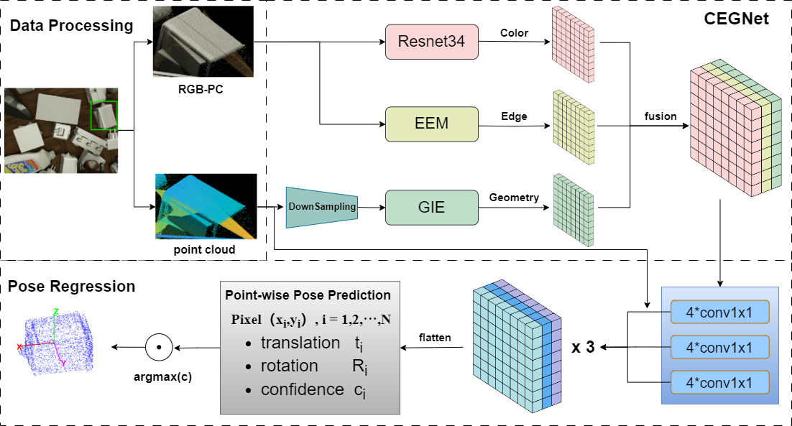

# model 

In CEGNet, we propose an efficient backbone for real-time instance-level 6D pose estimation. Besides, we propose EEM to solve the ambiguity problem in the widely used ADD-S metric.
We recommend you use the proposed ADD-P metric to train your own model!!! 


|Network architecture



### Installation
```
git clone git@github.com:origin-cw/CEGNet.git
cd CEGNet
conda env create -f CEGNet.yaml
```

## Download: datasets

<details>
  <summary> Directory structure for the download datasets </summary>

    datasets
    |-- tless     # http://cmp.felk.cvut.cz/t-less/download.html
    |   |-- train_pbr # https://bop.felk.cvut.cz/media/data/bop_datasets/tless_train_pbr.zip  
    |   |     |-- 000000
    |   |     |     |-- depth
    |   |     |     |-- mask
    |   |     |     |-- rgb
    |   |     |     |-- scene_camera.json
    |   |     |     |-- scene_gt.json
    |   |     |-- 000001
    |   | 
    |   |-- test_primesense  # https://github.com/GodZarathustra/stablepose_pytorch
    |   |     |-- 000001
    |   |     |     |-- depth
    |   |     |     |-- mask_visib
    |   |     |     |-- mask_visib_pred // (please find the prediction result from Stablepose)
    |   |     |     |-- rgb
    |   |     |     |-- scene_camera.json
    |   |     |     |-- scene_gt.json
    |   |     |     |-- scene_gt_info.json
    |   |     |-- 000002
  
        
</details>

## T-LESS

### data pre-processing
```bash
We will first convert the training and test data sets from image format to mat format.. 

It may result in an error due to duplicate file names, so simply retry the order.

-------------------------------------------------------------------------------------------------------------------------------------

$ python ./datasets/tless/tless_preparation.py --tless_path ./datasets/tless --train_set True

If succeed, it will have ./datasets/tless/train_pbr_mat and ./datasets/tless/train_pbr_mat.txt for the dataloader

-------------------------------------------------------------------------------------------------------------------------------------

$ python ./datasets/tless/tless_preparation.py --tless_path ./datasets/tless --train_set False

If succeed, it will have ./datasets/tless/test_primesense_gt_mask_mat and ./datasets/tless/test_primesense_gt_mask_mat.txt for the dataloader


At last, please download the downsample pcd files (https://www.dropbox.com/sh/zxq5lx71zpq4nts/AAALVgeSvszpHEy8CUBr8iala?dl=0), and place the models into ./datasets/tless

```


### Train
To train `tless` and evaluate testset at the end of training (metric for `add(s)`), run:

```bash
$ python train.py --loss_type ADD
```

<details>
  <summary> Some messages for the training on T-LESS dataset  </summary>

1. The initial learning rate is set to 0.002, and it decreases as the number of epochs increases.
2. The synthetic training dataset requires appropriate data augmentation to significantly improve performance in real-world testing scenarios. Introducing random noise to the point cloud has yielded noticeable performance improvements. Thus, additional investigation into more suitable data augmentation techniques is necessary.
3. The training strategy entails decreasing the learning rate to one-tenth of its initial value every 30 epochs. Our training included a total of 90 epochs. However, based on the loss curve, it appears that training for so many epochs may not be necessary with a more appropriate learning rate strategy.

</details>

### Evaluation
To only evaluate the testset `add(s)` the trained `tless` without re-training, please define the checkpoint_PATH and run:
```bash
$ python train.py --test_only True --resume ./experiments/checkpoint_0120.pth.tar 
```


## YCB-Video 
### data pre-processing
```bash
We will first convert the training and test data sets from image format to mat format.. 

It may result in an error due to duplicate file names, so simply retry the order.

-------------------------------------------------------------------------------------------------------------------------------------

$ python ./datasets/ycb/ycb_dataset.py --ycb_path ./datasets/ycb --train_set True

If succeed, it will have ./datasets/ycb/train_pbr_mat and ./datasets/ycb/train_pbr_mat.txt for the dataloader

-------------------------------------------------------------------------------------------------------------------------------------

$ python ./datasets/ycb/tless_preparation.py --ycb_path ./datasets/ycb --train_set False

If succeed, it will have ./datasets/ycb/test_primesense_gt_mask_mat and ./datasets/ycb/test_primesense_gt_mask_mat.txt for the dataloader


```

### Train
To train `ycb` and evaluate testset at the end of training (metric for `add(s)`), run:

```bash
$ python train.py --loss_type ADDS
```


## Acknowledgment
This work can not be finished well without the following reference, many thanks for the author's contribution: 
[DenseFusion](https://github.com/j96w/DenseFusion), [PVN3D](https://github.com/ethnhe/PVN3D), [FFB6D](https://github.com/ethnhe/FFB6D), [Stablepose](https://github.com/GodZarathustra/stablepose_pytorch). 


### Update

- `2023.09.10`: **Initial release.**
- To do: the experiment details on other dataset.    

